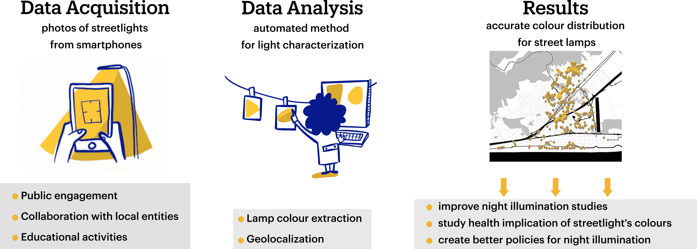

# NightUp

This is the accompanying repository to the NightUp paper. It contains a notebook and a set of examples of streetlight images made during the NightUp pilot campaign. What's NightUP about? Here is a summary:

In the notebook you will find the necessary tools for the Analysis part from the figure above. To know more about NightUp,  you can check our recent paper (DOI link above) or visit the [project's webpage](https://nightup.icfo.eu/desktop).
